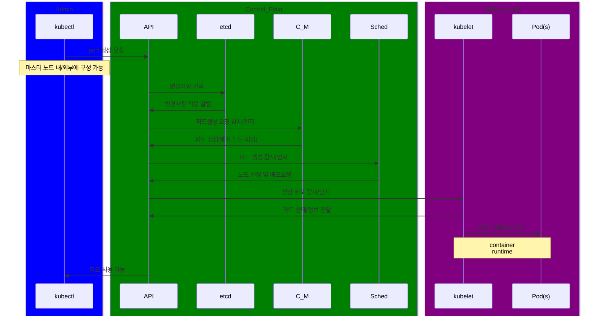

# kubectl이 CP와 분리된 경우
  CP의 `/etc/kubernetes/admin.conf`를 복사하여 사용.\
  `kubectl get nodes --kubeconfig admin.conf`

# Control plain VS worker node
### Control plain
    Declarative, not workflow.
    추구하는 상태를 API에 선언하면 다른 요소들이 현재 상태(etcd)와 비교하여 변경하는 선언적 구조.
    이미 생성된 파드들을 유기적으로 연결하고 클러스터를 안정적으로 유지하기 위함.
### worker node
    kubelet -> container runtime -> pods 과정의 워크플로우 구조.
---

# Pod life cycle

---

